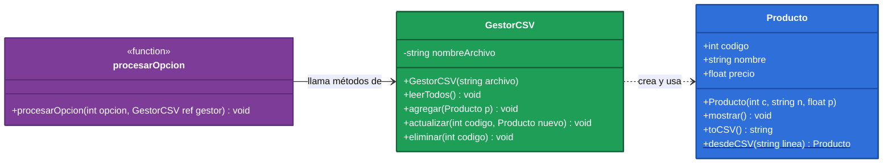
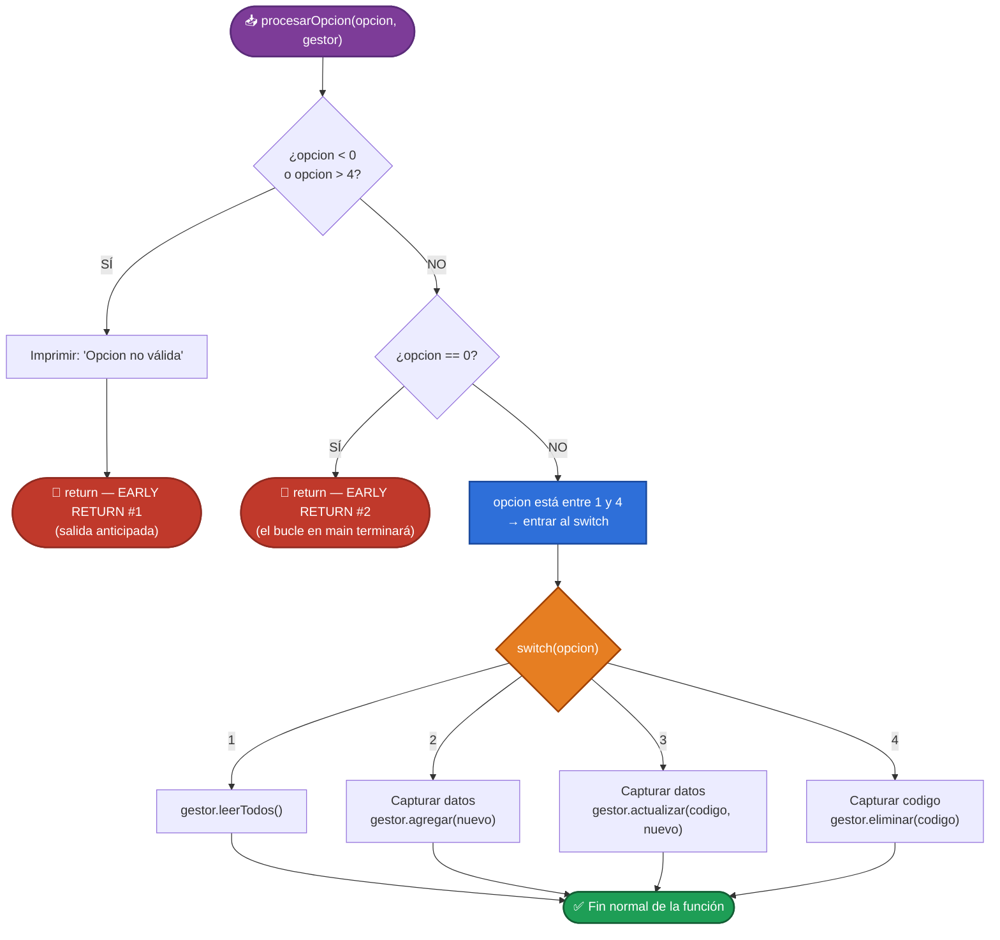
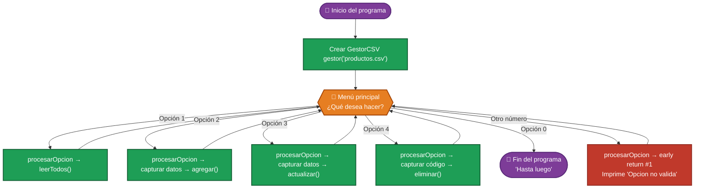
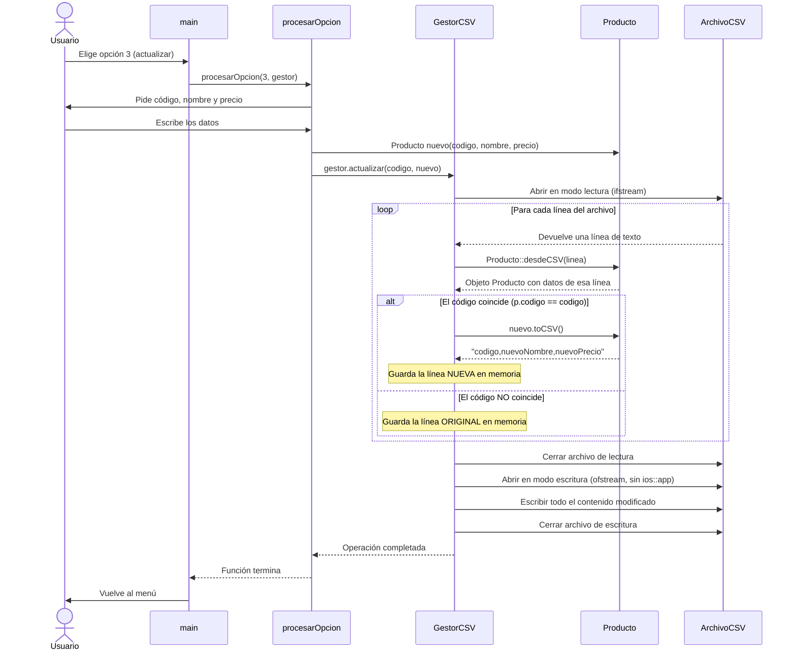
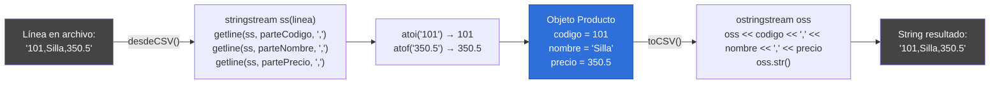

# Explicación: Sistema de Inventario CSV con POO

Este programa en C++ aplica los principios de la **Programación Orientada a Objetos** (POO)
para gestionar un inventario de artículos guardado en un archivo de texto con formato CSV.

---

## Índice

1. [¿Qué hace este programa?](#1-qué-hace-este-programa)
2. [Las bibliotecas `#include`](#2-las-bibliotecas-include)
3. [¿Qué es un archivo CSV?](#3-qué-es-un-archivo-csv)
4. [Estructura general del programa](#4-estructura-general-del-programa)
5. [Clase `Producto` — explicación detallada](#5-clase-producto--explicación-detallada)
6. [Clase `GestorCSV` — explicación detallada](#6-clase-gestorcsv--explicación-detallada)
7. [Función `procesarOpcion` y el patrón Early Return](#7-función-procesaropcion-y-el-patrón-early-return)
8. [Función `main`](#8-función-main)
9. [Diagramas](#9-diagramas)
10. [Resumen de conceptos POO aplicados](#10-resumen-de-conceptos-poo-aplicados)
11. [Cómo compilar y ejecutar](#11-cómo-compilar-y-ejecutar)

---

## 1. ¿Qué hace este programa?

El programa es un **sistema de inventario** para un supermercado. Permite:

| Operación | Descripción |
|---|---|
| **Leer** | Muestra todos los artículos guardados en el archivo |
| **Agregar** | Añade un artículo nuevo al final del archivo |
| **Actualizar** | Cambia el nombre y precio de un artículo buscado por código |
| **Eliminar** | Borra un artículo buscado por código |

Todos los datos viven en un archivo de texto llamado `productos.csv`.
No hay base de datos: el archivo **es** el almacén de datos.

---

## 2. Las bibliotecas `#include`

Al inicio del archivo hay cuatro líneas que "importan" herramientas listas para usar:

```cpp
#include <iostream>   // Para cout y cin
#include <fstream>    // Para leer y escribir archivos
#include <string>     // Para usar el tipo string
#include <sstream>    // Para ostringstream y stringstream
```

### ¿Para qué sirve cada una?

---

### `<iostream>` — Entrada y salida por pantalla

Proporciona `cout` (imprimir en pantalla) y `cin` (leer del teclado).

```cpp
cout << "Hola mundo" << endl;  // Imprime texto
cin  >> opcion;                // Lee un número del teclado
```

---

### `<fstream>` — Lectura y escritura de archivos

Es la biblioteca más importante para este programa. Proporciona dos tipos:

| Tipo | Significa | Uso |
|---|---|---|
| `ifstream` | **i**nput **f**ile **stream** | Abrir un archivo para **leer** |
| `ofstream` | **o**utput **f**ile **stream** | Abrir un archivo para **escribir** |

**Abrir para leer:**
```cpp
ifstream archivo("productos.csv");

if (!archivo.is_open()) {
    // El archivo no existe o no se pudo abrir
    return;
}

string linea;
while (getline(archivo, linea)) {
    // Procesa cada línea...
}

archivo.close();  // Siempre cerrar al terminar
```

**Abrir para escribir (sobreescribir todo):**
```cpp
ofstream archivo("productos.csv");
archivo << "101,Silla,350.5" << endl;
archivo.close();
```

**Abrir para agregar al final (`ios::app`):**
```cpp
ofstream archivo("productos.csv", ios::app);  // "app" = append (añadir)
archivo << "102,Mesa,800" << endl;
archivo.close();
```

> **Importante:** Si abres un `ofstream` **sin** `ios::app`, borra todo el contenido anterior.
> Si lo abres **con** `ios::app`, agrega al final sin borrar nada.

---

### `<string>` — Cadenas de texto

Permite usar el tipo `string` que guarda texto de longitud variable.

```cpp
string nombre = "Silla de oficina";
string linea  = "101,Silla de oficina,350.5";
```

La función `getline(flujo, variable, delimitador)` de esta biblioteca corta texto
en partes usando un carácter separador (en este programa se usa la coma `,`).

---

### `<sstream>` — Flujos en memoria (como archivos, pero en texto)

Proporciona dos tipos que funcionan igual que `ifstream`/`ofstream` pero trabajan
sobre un `string` en memoria, sin tocar ningún archivo en disco.

| Tipo | Uso en este programa |
|---|---|
| `stringstream` | Leer partes separadas de una línea CSV |
| `ostringstream` | Construir una línea CSV uniendo datos |

**`stringstream` — separar una línea CSV:**
```cpp
string linea = "101,Silla,350.5";
stringstream ss(linea);

string parteCodigo, parteNombre, partePrecio;
getline(ss, parteCodigo, ',');  // "101"
getline(ss, parteNombre, ',');  // "Silla"
getline(ss, partePrecio, ',');  // "350.5"
```

**`ostringstream` — unir datos en una línea CSV:**
```cpp
int    codigo = 101;
string nombre = "Silla";
float  precio = 350.5;

ostringstream oss;
oss << codigo << "," << nombre << "," << precio;
string resultado = oss.str();  // "101,Silla,350.5"
```

---

## 3. ¿Qué es un archivo CSV?

Un archivo CSV (**C**omma **S**eparated **V**alues) es un archivo de texto normal donde cada
línea representa un registro y los datos están separados por comas.

**Ejemplo de `productos.csv`:**
```
101,Silla de oficina,350.5
102,Escritorio,1200
103,Lámpara de escritorio,189.99
```

Cada línea sigue el formato: `codigo,nombre,precio`

> El programa **no puede editar una línea del archivo directamente**.
> Para modificar o eliminar, debe leer todo, hacer cambios en memoria, y reescribir el archivo completo.

---

## 4. Estructura general del programa

El programa está dividido en **dos clases**, **una función auxiliar** y **la función principal**:

| Parte | Función |
|---|---|
| `Producto` | Representa un solo artículo: guarda sus datos y sabe cómo convertirlos a/desde CSV |
| `GestorCSV` | Maneja el archivo: sabe cómo leer, agregar, actualizar y eliminar artículos |
| `procesarOpcion()` | Función libre que aplica **early return** para decidir qué operación ejecutar |
| `main()` | Muestra el menú en bucle y delega la lógica a `procesarOpcion()` |

---

## 5. Clase `Producto` — explicación detallada

Representa **un solo artículo** del inventario. Cada vez que el programa necesita
trabajar con un artículo, crea un objeto de esta clase.

### Atributos (datos que guarda)

```cpp
class Producto {
public:
    int    codigo;  // Número único del artículo (ej: 101)
    string nombre;  // Nombre del artículo (ej: "Silla de oficina")
    float  precio;  // Precio en pesos (ej: 350.5)
```

Son `public` porque `GestorCSV` necesita leerlos directamente
(por ejemplo: `if (p.codigo == codigo)`).

---

### Constructor — `Producto(int c, string n, float p)`

| Parámetro | Tipo | Descripción |
|---|---|---|
| `c` | `int` | Código del artículo |
| `n` | `string` | Nombre del artículo |
| `p` | `float` | Precio del artículo |

```cpp
Producto(int c, string n, float p) {
    codigo = c;
    nombre = n;
    precio = p;
}
```

**Uso:**
```cpp
Producto silla(101, "Silla de oficina", 350.5);
//              ↑ c       ↑ n               ↑ p
```

El constructor se ejecuta **automáticamente** al escribir esa línea.
Asigna los tres valores a los atributos del objeto.

---

### Método `mostrar()` — sin parámetros, sin retorno

Imprime los datos del artículo en pantalla con formato.

```cpp
void mostrar() {
    cout << "  Codigo : " << codigo  << endl;
    cout << "  Nombre : " << nombre  << endl;
    cout << "  Precio : $" << precio << endl;
    cout << "  --------------------------" << endl;
}
```

- **Parámetros:** ninguno. Usa los atributos del propio objeto.
- **Retorno:** `void` (no devuelve nada).
- **Uso:** `p.mostrar();`

---

### Método `toCSV()` — sin parámetros, devuelve `string`

Convierte el objeto a una línea de texto en formato CSV para guardar en el archivo.

```cpp
string toCSV() {
    ostringstream oss;
    oss << codigo << "," << nombre << "," << precio;
    return oss.str();
}
```

- **Parámetros:** ninguno.
- **Retorno:** `string` con el formato `"codigo,nombre,precio"`.
- **Uso:** `archivo << p.toCSV() << endl;`

**Ejemplo de salida:**
```
101,Silla de oficina,350.5
```

---

### Método estático `desdeCSV(string linea)` — convierte texto en objeto

| Parámetro | Tipo | Descripción |
|---|---|---|
| `linea` | `string` | Una línea del archivo CSV |

```cpp
static Producto desdeCSV(string linea) {
    stringstream ss(linea);
    string parteCodigo, parteNombre, partePrecio;

    getline(ss, parteCodigo, ',');  // Extrae "101"
    getline(ss, parteNombre, ',');  // Extrae "Silla de oficina"
    getline(ss, partePrecio, ',');  // Extrae "350.5"

    int   c = atoi(parteCodigo.c_str());  // "101"   → 101  (texto a entero)
    float p = atof(partePrecio.c_str());  // "350.5" → 350.5 (texto a decimal)

    return Producto(c, parteNombre, p);   // Crea y devuelve el objeto
}
```

- **`static`**: pertenece a la **clase**, no a un objeto. Se llama con `::` en lugar de un punto.
- **`atoi`**: convierte un `string` a `int`. (`"101"` → `101`)
- **`atof`**: convierte un `string` a `float`. (`"350.5"` → `350.5`)
- **`.c_str()`**: convierte un `string` moderno de C++ al tipo de texto antiguo que `atoi`/`atof` esperan.
- **Retorno:** un objeto `Producto` listo para usar.

**Uso (sin necesitar un objeto previo):**
```cpp
Producto p = Producto::desdeCSV("101,Silla,350.5");
//                        ↑↑ doble dos puntos = método estático
```

---

## 6. Clase `GestorCSV` — explicación detallada

Se encarga de **todas las operaciones con el archivo**. Solo conoce un dato: el nombre del archivo.

### Atributo privado

```cpp
private:
    string nombreArchivo;  // Ej: "productos.csv"
```

Es `private` porque nadie fuera de la clase necesita cambiarlo directamente.

---

### Constructor — `GestorCSV(string archivo)`

| Parámetro | Tipo | Descripción |
|---|---|---|
| `archivo` | `string` | Nombre del archivo CSV a gestionar |

```cpp
GestorCSV(string archivo) {
    nombreArchivo = archivo;
}
```

**Uso:** `GestorCSV gestor("productos.csv");`

---

### Método `leerTodos()` — sin parámetros

Lee el archivo línea por línea y muestra cada artículo en pantalla.

```cpp
void leerTodos() {
    ifstream archivo(nombreArchivo.c_str());  // Abrir en modo lectura

    if (!archivo.is_open()) {                 // EARLY RETURN: si no abre → salir
        cout << "El archivo no existe o esta vacio." << endl;
        return;
    }

    string linea;
    int conteo = 0;

    while (getline(archivo, linea)) {         // Leer línea por línea
        if (linea == "") continue;            // Ignorar líneas vacías
        Producto p = Producto::desdeCSV(linea);
        p.mostrar();
        conteo++;
    }

    if (conteo == 0) {
        cout << "No hay articulos registrados." << endl;
    }

    archivo.close();
}
```

**Flujo paso a paso:**

```
Abrir archivo
    ↓
¿Se abrió? → NO → Imprimir error → return (early return)
    ↓ SÍ
Leer línea por línea con getline()
    ↓
¿Línea vacía? → Ignorar con continue
    ↓
Convertir línea en objeto Producto con desdeCSV()
    ↓
Mostrar el artículo con mostrar()
    ↓
(Repetir hasta el final del archivo)
    ↓
Cerrar archivo
```

---

### Método `agregar(Producto p)`

| Parámetro | Tipo | Descripción |
|---|---|---|
| `p` | `Producto` | El artículo que se quiere guardar |

```cpp
void agregar(Producto p) {
    ofstream archivo(nombreArchivo.c_str(), ios::app);  // Abrir en modo "añadir al final"

    if (!archivo.is_open()) {    // EARLY RETURN: si no abre → salir
        cout << "Error: no se pudo abrir el archivo." << endl;
        return;
    }

    archivo << p.toCSV() << endl;  // Escribir la línea CSV
    archivo.close();
    cout << "Articulo agregado correctamente." << endl;
}
```

> `ios::app` = **append mode**: el archivo se abre sin borrar lo que ya contiene,
> y el cursor se posiciona al final para escribir ahí.

---

### Método `actualizar(int codigo, Producto nuevo)`

| Parámetro | Tipo | Descripción |
|---|---|---|
| `codigo` | `int` | Código del artículo a buscar y reemplazar |
| `nuevo` | `Producto` | Objeto con los datos actualizados |

**Estrategia:** No es posible editar una línea directamente. El proceso es:
1. Leer todo el archivo y guardar el contenido en memoria
2. Si una línea corresponde al código buscado → sustituirla por los datos nuevos
3. Si no corresponde → copiarla tal cual
4. Reescribir el archivo completo con el contenido modificado

```cpp
void actualizar(int codigo, Producto nuevo) {
    ifstream archivoLectura(nombreArchivo.c_str());

    if (!archivoLectura.is_open()) {     // EARLY RETURN #1
        cout << "Error: no se pudo abrir el archivo." << endl;
        return;
    }

    string contenidoNuevo = "";
    string linea;
    bool encontrado = false;

    while (getline(archivoLectura, linea)) {
        if (linea == "") continue;

        Producto p = Producto::desdeCSV(linea);

        if (p.codigo == codigo) {
            nuevo.codigo = codigo;                    // Conservar el código original
            contenidoNuevo += nuevo.toCSV() + "\n";  // Línea reemplazada
            encontrado = true;
        } else {
            contenidoNuevo += linea + "\n";           // Línea copiada tal cual
        }
    }

    archivoLectura.close();

    if (!encontrado) {                               // EARLY RETURN #2
        cout << "No se encontro el articulo con codigo " << codigo << "." << endl;
        return;
    }

    // Solo llega aquí si encontró el artículo
    ofstream archivoEscritura(nombreArchivo.c_str());  // Reescribir todo
    archivoEscritura << contenidoNuevo;
    archivoEscritura.close();

    cout << "Articulo actualizado correctamente." << endl;
}
```

---

### Método `eliminar(int codigo)`

| Parámetro | Tipo | Descripción |
|---|---|---|
| `codigo` | `int` | Código del artículo que se quiere borrar |

**Estrategia:** Igual que `actualizar`, pero en lugar de sustituir la línea coincidente,
simplemente **no la copia** al nuevo contenido.

```cpp
void eliminar(int codigo) {
    ifstream archivoLectura(nombreArchivo.c_str());

    if (!archivoLectura.is_open()) {     // EARLY RETURN #1
        cout << "Error: no se pudo abrir el archivo." << endl;
        return;
    }

    string contenidoNuevo = "";
    string linea;
    bool encontrado = false;

    while (getline(archivoLectura, linea)) {
        if (linea == "") continue;

        Producto p = Producto::desdeCSV(linea);

        if (p.codigo == codigo) {
            encontrado = true;           // Esta línea se OMITE (no se copia)
        } else {
            contenidoNuevo += linea + "\n";
        }
    }

    archivoLectura.close();

    if (!encontrado) {                   // EARLY RETURN #2
        cout << "No se encontro el articulo con codigo " << codigo << "." << endl;
        return;
    }

    ofstream archivoEscritura(nombreArchivo.c_str());
    archivoEscritura << contenidoNuevo;
    archivoEscritura.close();

    cout << "Articulo eliminado correctamente." << endl;
}
```

---

## 7. Función `procesarOpcion` y el patrón Early Return

### ¿Qué es el Early Return?

El **early return** (retorno anticipado) es una técnica de programación donde
se validan las condiciones de error **al inicio** de una función y se sale
(`return`) inmediatamente si algo está mal.

Esto evita anidar todo el código en bloques `if/else/else if` y hace que
el código sea más fácil de leer.

---

### Comparación: sin y con early return

**❌ Sin early return — versión anterior (difícil de leer):**

```cpp
// main() tenía toda la lógica anidada con if/else if:
if (opcion == 1) {
    gestor.leerTodos();
} else if (opcion == 2) {
    // ...capturar datos...
    gestor.agregar(nuevo);
} else if (opcion == 3) {
    // ...capturar datos...
    gestor.actualizar(codigo, nuevo);
} else if (opcion == 4) {
    // ...
    gestor.eliminar(codigo);
} else if (opcion != 0) {
    cout << "Opcion no valida." << endl;
}
// Si quisieras agregar más validaciones, tendrías que
// seguir anidando más else if
```

**✅ Con early return — versión actual (limpia y plana):**

```cpp
void procesarOpcion(int opcion, GestorCSV& gestor) {

    // EARLY RETURN #1: opción fuera del rango 0–4
    if (opcion < 0 || opcion > 4) {
        cout << "Opcion no valida. Elige entre 0 y 4." << endl;
        return;   // ← sale aquí, no ejecuta nada más
    }

    // EARLY RETURN #2: opción 0 (el usuario quiere salir)
    if (opcion == 0) {
        return;   // ← sale aquí, el bucle en main() se encarga de terminar
    }

    // A partir de aquí, opcion está garantizada entre 1 y 4.
    // El switch es plano, sin anidamientos.
    switch (opcion) {
        case 1: gestor.leerTodos();         break;
        case 2: /* capturar y agregar */    break;
        case 3: /* capturar y actualizar */ break;
        case 4: /* capturar y eliminar */   break;
    }
}
```

### Firma de la función

```cpp
void procesarOpcion(int opcion, GestorCSV& gestor)
```

| Parámetro | Tipo | Descripción |
|---|---|---|
| `opcion` | `int` | Número que el usuario escribió en el menú |
| `gestor` | `GestorCSV&` | Referencia al objeto gestor del archivo |

> **`GestorCSV&` con el símbolo `&`** significa que se pasa **por referencia**.
> Esto quiere decir que la función trabaja con el mismo objeto que existe en `main()`,
> no con una copia. Si `GestorCSV` hiciera cambios internos, se verían reflejados
> en el objeto original.

---

### Ventajas del early return

| Aspecto | Sin early return | Con early return |
|---|---|---|
| Validación de errores | Mezclada con el código normal | Al inicio, separada y visible |
| Niveles de indentación | Muchos (`else if` anidados) | Pocos (código plano) |
| Facilidad para agregar casos | Hay que modificar la cadena `else if` | Se agrega un `if` al inicio |
| Legibilidad | El lector tiene que seguir todos los `else` | El "camino feliz" es directo y claro |

---

## 8. Función `main`

```cpp
int main() {
    GestorCSV gestor("productos.csv");  // Crear el gestor del archivo
    int opcion;

    do {
        // Mostrar el menú...
        cout << "Elige una opcion: ";
        cin  >> opcion;
        cin.ignore();  // Limpiar el enter del buffer

        procesarOpcion(opcion, gestor);  // Delegar la lógica

    } while (opcion != 0);  // Repetir mientras el usuario no elija 0

    cout << "Hasta luego." << endl;
    return 0;
}
```

**`cin.ignore()`** descarta el carácter `\n` (Enter) que queda en el buffer
después de leer un número con `cin >> opcion`. Sin esta línea, el siguiente
`getline(cin, ...)` leería una cadena vacía en lugar de esperar al usuario.

**`do { } while (condicion)`** ejecuta el bloque **al menos una vez** antes de
evaluar la condición. Es ideal para menús: siempre se muestra el menú al menos
una vez, y se repite hasta que el usuario elija 0.

---

## 9. Diagramas

### Diagrama A — Clases y sus relaciones



> - `$` en `desdeCSV` = **método estático** (se llama con `Producto::desdeCSV(...)`).
> - `+` = miembro **público** / `-` = miembro **privado**.
> - `..>` = "usa objetos de este tipo".
> - `-->` = "llama métodos de".

---

### Diagrama B — Flujo del Early Return en `procesarOpcion`



---

### Diagrama C — Flujo completo del menú principal



---

### Diagrama D — Secuencia de `actualizar` (el método más complejo)

> La misma estrategia aplica para `eliminar`, con la diferencia de que la línea
> encontrada simplemente **no se copia** en lugar de sustituirse.



---

### Diagrama E — Cómo se convierte una línea CSV en objeto y viceversa



---

## 10. Resumen de conceptos POO aplicados

| Concepto POO | Dónde se usa en el programa |
|---|---|
| **Clase** | `Producto` y `GestorCSV` |
| **Objeto** | `Producto nuevo(101, "Silla", 350.5)` y `GestorCSV gestor("productos.csv")` |
| **Constructor** | `Producto(int, string, float)` y `GestorCSV(string)` |
| **Atributo público** | `codigo`, `nombre`, `precio` en `Producto` |
| **Atributo privado** | `nombreArchivo` en `GestorCSV` |
| **Método** | `mostrar()`, `toCSV()`, `leerTodos()`, `agregar()`, `actualizar()`, `eliminar()` |
| **Método estático** | `Producto::desdeCSV(linea)` — se llama sin necesitar un objeto |
| **Paso por referencia** | `GestorCSV& gestor` en `procesarOpcion()` — trabaja con el objeto original, no una copia |
| **Early Return** | `procesarOpcion()` y todos los métodos de `GestorCSV` validan al inicio y retornan si algo falla |

---

## 11. Cómo compilar y ejecutar

```bash
# Compilar
g++ inventario_csv.cpp -o inventario_csv

# Ejecutar en Linux/Mac
./inventario_csv

# Ejecutar en Windows
inventario_csv.exe
```

> El archivo `productos.csv` se crea automáticamente la primera vez que se agrega un artículo.
> Si quieres empezar desde cero, simplemente borra el archivo `productos.csv`.
