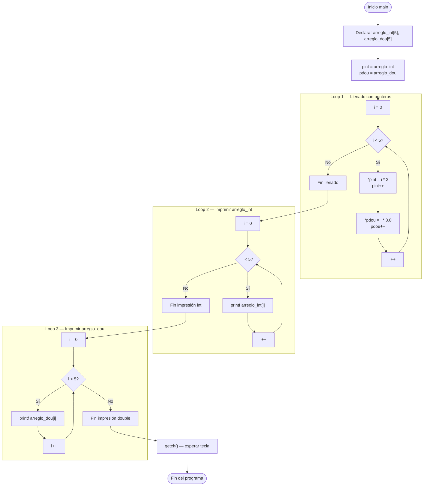

# clase-cuatro-arrays.cpp — Arreglos con aritmética de punteros

## Descripción general

Este programa demuestra cómo llenar e imprimir **dos arreglos** (uno de enteros y uno
de doubles) usando **aritmética de punteros** en lugar de índices directos.

- Se declaran dos arreglos: `arreglo_int[5]` y `arreglo_dou[5]`.
- Se usan punteros (`pint`, `pdou`) que apuntan al inicio de cada arreglo.
- Un ciclo `for` llena ambos arreglos simultáneamente usando los punteros.
- Otros dos ciclos imprimen los valores de cada arreglo por separado.

---

## Librerías incluidas

```cpp
#include <stdio.h>
#include <conio.h>
```

| Librería | Para qué sirve |
|---|---|
| `<stdio.h>` | Provee `printf()` para imprimir texto con formato en la consola |
| `<conio.h>` | Provee `getch()` para pausar la consola esperando una tecla (solo Windows / Dev-C++) |

> **Nota:** este archivo usa el estilo **C clásico** (`printf`, `getch`) en lugar
> de `cout` de C++. Ambos son válidos; Dev-C++ acepta los dos.

---

## Concepto clave: aritmética de punteros

Un **puntero** es una variable que guarda la **dirección de memoria** de otra variable.

```cpp
int arreglo_int[5];   // arreglo de 5 enteros en memoria contigua
int *pint;            // puntero a entero (guarda una dirección)

pint = arreglo_int;   // pint apunta al primer elemento del arreglo
```

Una vez que el puntero apunta al inicio del arreglo:

| Operación | Significado |
|---|---|
| `*pint` | Lee o escribe el valor en la posición actual |
| `pint++` | Mueve el puntero a la **siguiente posición** del arreglo |
| `*pint = valor` | Escribe `valor` en la posición actual |

### `sizeof` para calcular el tamaño del arreglo

```cpp
sizeof(arreglo_int) / sizeof(*arreglo_int)
```

| Parte | Resultado |
|---|---|
| `sizeof(arreglo_int)` | Tamaño total en bytes (5 enteros × 4 bytes = **20**) |
| `sizeof(*arreglo_int)` | Tamaño de un solo elemento en bytes (**4**) |
| División | Número de elementos: 20 / 4 = **5** |

Esto evita usar el número `5` directamente (número mágico).

---

## Lógica del programa (en `main()`)

```cpp
main()
{
    int *pint, arreglo_int[5];
    double *pdou, arreglo_dou[5];

    pint = arreglo_int;
    pdou = arreglo_dou;

    for (int i = 0; i < sizeof(arreglo_int)/sizeof(*arreglo_int); i++)
    {
        *pint = i * 2;
        pint++;
        *pdou = i * 3.0;
        pdou++;
    }

    for (int i = 0; i < sizeof(arreglo_int)/sizeof(*arreglo_int); i++)
        printf("el valor de pint es %d en la posicion %d\n", arreglo_int[i], i);

    for (int i = 0; i < sizeof(arreglo_dou)/sizeof(*arreglo_dou); i++)
        printf("el valor de pint es %f en la posicion %d\n", arreglo_dou[i], i);

    getch();
}
```

### Paso 1 — Declaración e inicialización de punteros

```cpp
int *pint, arreglo_int[5];
double *pdou, arreglo_dou[5];

pint = arreglo_int;   // pint apunta a arreglo_int[0]
pdou = arreglo_dou;   // pdou apunta a arreglo_dou[0]
```

Después de estas líneas, `pint` y `pdou` apuntan cada uno al **primer elemento**
de su respectivo arreglo.

---

### Paso 2 — Loop de llenado (ambos arreglos simultáneamente)

```cpp
for (int i = 0; i < 5; i++)
{
    *pint = i * 2;   // escribe en arreglo_int[i]
    pint++;           // avanza al siguiente entero
    *pdou = i * 3.0; // escribe en arreglo_dou[i]
    pdou++;           // avanza al siguiente double
}
```

**¿Qué hace?**

1. `i = 0`: escribe `0*2 = 0` en `arreglo_int[0]` y `0*3.0 = 0.0` en `arreglo_dou[0]`, luego avanza ambos punteros.
2. `i = 1`: escribe `1*2 = 2` en `arreglo_int[1]` y `1*3.0 = 3.0` en `arreglo_dou[1]`, avanza.
3. Continúa hasta `i = 4`.

#### Traza del arreglo de enteros (`i * 2`)

| `i` | Operación | Estado de `arreglo_int` |
|-----|-----------|--------------------------|
| 0 | `*pint = 0` | `[0, ?, ?, ?, ?]` |
| 1 | `*pint = 2` | `[0, 2, ?, ?, ?]` |
| 2 | `*pint = 4` | `[0, 2, 4, ?, ?]` |
| 3 | `*pint = 6` | `[0, 2, 4, 6, ?]` |
| 4 | `*pint = 8` | `[0, 2, 4, 6, 8]` ✅ |

#### Traza del arreglo de doubles (`i * 3.0`)

| `i` | Operación | Estado de `arreglo_dou` |
|-----|-----------|--------------------------|
| 0 | `*pdou = 0.0` | `[0.0, ?, ?, ?, ?]` |
| 1 | `*pdou = 3.0` | `[0.0, 3.0, ?, ?, ?]` |
| 2 | `*pdou = 6.0` | `[0.0, 3.0, 6.0, ?, ?]` |
| 3 | `*pdou = 9.0` | `[0.0, 3.0, 6.0, 9.0, ?]` |
| 4 | `*pdou = 12.0` | `[0.0, 3.0, 6.0, 9.0, 12.0]` ✅ |

---

### Paso 3 — Loop de impresión de enteros

```cpp
for (int i = 0; i < 5; i++)
    printf("el valor de pint es %d en la posicion %d\n", arreglo_int[i], i);
```

Usa el especificador `%d` para enteros. Aquí ya no se usa el puntero; se accede
al arreglo con el índice `i` directamente.

**Salida:**
```
el valor de pint es 0 en la posicion 0
el valor de pint es 2 en la posicion 1
el valor de pint es 4 en la posicion 2
el valor de pint es 6 en la posicion 3
el valor de pint es 8 en la posicion 4
```

---

### Paso 4 — Loop de impresión de doubles

```cpp
for (int i = 0; i < 5; i++)
    printf("el valor de pint es %f en la posicion %d\n", arreglo_dou[i], i);
```

Usa el especificador `%f` para números de punto flotante (`double`).

**Salida:**
```
el valor de pint es 0.000000 en la posicion 0
el valor de pint es 3.000000 en la posicion 1
el valor de pint es 6.000000 en la posicion 2
el valor de pint es 9.000000 en la posicion 3
el valor de pint es 12.000000 en la posicion 4
```

---

### Paso 5 — `getch()`

```cpp
getch();
```

Pausa el programa esperando que el usuario presione cualquier tecla antes de cerrar
la ventana de la consola. Es una función de `<conio.h>`, solo disponible en Windows / Dev-C++.

---

## Salida completa del programa

```
el valor de pint es 0 en la posicion 0
el valor de pint es 2 en la posicion 1
el valor de pint es 4 en la posicion 2
el valor de pint es 6 en la posicion 3
el valor de pint es 8 en la posicion 4
el valor de pint es 0.000000 en la posicion 0
el valor de pint es 3.000000 en la posicion 1
el valor de pint es 6.000000 en la posicion 2
el valor de pint es 9.000000 en la posicion 3
el valor de pint es 12.000000 en la posicion 4
```

---

## Pseudocódigo

```
INICIO

  Declarar arreglo_int[5] de enteros
  Declarar arreglo_dou[5] de doubles
  Declarar puntero pint → apunta a arreglo_int[0]
  Declarar puntero pdou → apunta a arreglo_dou[0]

  PARA i desde 0 hasta 4:
    *pint ← i * 2        // llenar posición actual del arreglo_int
    avanzar pint          // mover puntero a la siguiente posición
    *pdou ← i * 3.0      // llenar posición actual del arreglo_dou
    avanzar pdou          // mover puntero a la siguiente posición
  FIN PARA

  PARA i desde 0 hasta 4:
    imprimir arreglo_int[i] con su posición
  FIN PARA

  PARA i desde 0 hasta 4:
    imprimir arreglo_dou[i] con su posición
  FIN PARA

  Esperar tecla (getch)

FIN
```

---

## Diagrama de flujo


