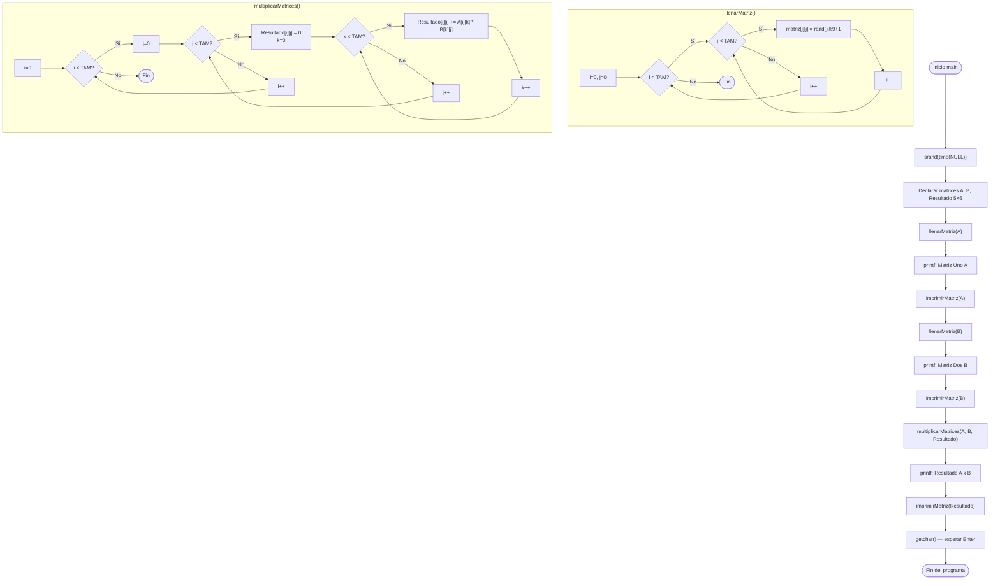

# clase-cuatro-matrices.cpp — Multiplicación de matrices con números aleatorios

## Descripción general

Este programa declara dos matrices cuadradas de tamaño **5×5**, las llena con
**números aleatorios** entre 1 y 9, las muestra en pantalla y luego calcula
su **producto matricial** (A × B), mostrando el resultado.

Contiene tres funciones:

- `llenarMatriz()` → llena una matriz con valores aleatorios usando `rand()`
- `imprimirMatriz()` → imprime una matriz en formato de tabla alineada
- `multiplicarMatrices()` → realiza el producto matricial clásico (triple `for`)

---

## Librerías incluidas

```cpp
#include <stdio.h>
#include <stdlib.h>
#include <time.h>

#define TAM 5
```

| Librería / Directiva | Para qué sirve |
|---|---|
| `<stdio.h>` | Provee `printf()` para imprimir texto con formato y `getchar()` para pausar la consola |
| `<stdlib.h>` | Provee `rand()` (generar número aleatorio) y `srand()` (inicializar la semilla) |
| `<time.h>` | Provee `time(NULL)` que devuelve la hora actual en segundos, usada como semilla aleatoria |
| `#define TAM 5` | Define la constante `TAM = 5` para el tamaño de las matrices, evitando "números mágicos" |

### ¿Por qué `srand(time(NULL))`?

```cpp
srand(time(NULL));
```

`rand()` por defecto genera **siempre la misma secuencia** de números si no se
inicializa la semilla. Al pasarle `time(NULL)` (la hora actual en segundos),
la secuencia cambia cada vez que se ejecuta el programa.

| Sin `srand` | Con `srand(time(NULL))` |
|---|---|
| Siempre los mismos números | Números diferentes en cada ejecución |

---

## Concepto clave: Producto matricial

El producto A × B entre dos matrices cuadradas de tamaño N×N se calcula así:

```
Resultado[i][j] = Σ (A[i][k] * B[k][j])  para k = 0..N-1
```

Es decir: cada celda `[i][j]` del resultado es la **suma de los productos**
de la fila `i` de A por la columna `j` de B.

### Ejemplo simplificado (2×2):

```
A = [1, 2]    B = [5, 6]
    [3, 4]        [7, 8]

Resultado[0][0] = 1*5 + 2*7 = 19
Resultado[0][1] = 1*6 + 2*8 = 22
Resultado[1][0] = 3*5 + 4*7 = 43
Resultado[1][1] = 3*6 + 4*8 = 50
```

---

## Funciones

### `llenarMatriz()`

```cpp
void llenarMatriz(int arregloBidi[TAM][TAM])
{
    for (int i = 0; i < TAM; i++)
    {
        for (int j = 0; j < TAM; j++)
        {
            arregloBidi[i][j] = rand() % 9 + 1;
        }
    }
}
```

**¿Qué hace?**

1. Recorre todas las filas (`i`) y columnas (`j`) de la matriz.
2. En cada celda `[i][j]` asigna un número aleatorio entre **1 y 9**.
3. `rand() % 9` produce valores de 0 a 8. Sumando `+ 1` el rango queda de **1 a 9**.

> La matriz se pasa **por referencia implícita** (los arreglos en C++ siempre se
> pasan como puntero), por lo que los cambios dentro de la función afectan al
> arreglo original.

---

### `imprimirMatriz()`

```cpp
void imprimirMatriz(int arregloBidi[TAM][TAM])
{
    for (int i = 0; i < TAM; i++)
    {
        for (int j = 0; j < TAM; j++)
        {
            printf("%2d ", arregloBidi[i][j]);
        }
        printf("\n");
    }
}
```

**¿Qué hace?**

1. Recorre fila por fila (`i`), y dentro de cada fila, columna por columna (`j`).
2. Imprime cada valor con `%2d`: el `2` reserva **2 caracteres de ancho**, alineando
   los números en columnas aunque tengan 1 o 2 dígitos.
3. Al terminar cada fila imprime `\n` para saltar a la siguiente línea.

**Ejemplo de salida formateada:**
```
 3  7  1  9  2
 5  4  8  6  3
 1  2  9  7  5
 6  8  3  4  1
 9  1  5  2  7
```

---

### `multiplicarMatrices()`

```cpp
void multiplicarMatrices(int matA[TAM][TAM], int matB[TAM][TAM], int matResult[TAM][TAM])
{
    for (int i = 0; i < TAM; i++)
    {
        for (int j = 0; j < TAM; j++)
        {
            matResult[i][j] = 0;  // inicializar acumulador en 0

            for (int k = 0; k < TAM; k++)
            {
                matResult[i][j] += matA[i][k] * matB[k][j];
            }
        }
    }
}
```

**¿Qué hace?**

Usa **tres bucles anidados**:

| Variable | Recorre |
|---|---|
| `i` | Filas de la matriz A (y del resultado) |
| `j` | Columnas de la matriz B (y del resultado) |
| `k` | Posición compartida: columna de A y fila de B |

Para cada celda `[i][j]` del resultado:
1. Inicializa el acumulador en `0`.
2. En el bucle `k`, multiplica `matA[i][k]` por `matB[k][j]` y suma al acumulador.
3. Al terminar el bucle `k`, `matResult[i][j]` contiene el producto punto de la fila `i` de A y la columna `j` de B.

#### Traza del cálculo de una celda (ejemplo con TAM=2)

Para `i=0, j=0` calculando `Resultado[0][0]`:

| `k` | `matA[0][k]` | `matB[k][0]` | Producto | Acumulador |
|-----|-------------|-------------|---------|-----------|
| 0 | `matA[0][0]` | `matB[0][0]` | `a * b` | `0 + a*b` |
| 1 | `matA[0][1]` | `matB[1][0]` | `c * d` | `a*b + c*d` |

---

## Función `main()`

```cpp
int main()
{
    srand(time(NULL));

    int arregloBidiA[TAM][TAM];
    int arregloBidiB[TAM][TAM];
    int arregloBidiResultado[TAM][TAM];

    llenarMatriz(arregloBidiA);
    printf("Matriz Uno (A):\n");
    imprimirMatriz(arregloBidiA);
    printf("\n");

    llenarMatriz(arregloBidiB);
    printf("Matriz Dos (B):\n");
    imprimirMatriz(arregloBidiB);
    printf("\n");

    multiplicarMatrices(arregloBidiA, arregloBidiB, arregloBidiResultado);

    printf("Resultado de la Multiplicación (A x B):\n");
    imprimirMatriz(arregloBidiResultado);

    printf("\nPresiona Enter para salir...");
    getchar();

    return 0;
}
```

**Orden de ejecución:**

1. `srand(time(NULL))` — inicializa la semilla aleatoria
2. Declara las 3 matrices: A, B y Resultado
3. Llena e imprime la **Matriz A**
4. Llena e imprime la **Matriz B**
5. Calcula **A × B** y guarda en Resultado
6. Imprime la **Matriz Resultado**
7. Espera que el usuario presione Enter antes de cerrar

**Salida esperada (los valores varían en cada ejecución):**
```
Matriz Uno (A):
 3  7  1  9  2
 5  4  8  6  3
 ...

Matriz Dos (B):
 6  2  4  8  1
 9  3  7  5  4
 ...

Resultado de la Multiplicación (A x B):
 ...valores del producto matricial...

Presiona Enter para salir...
```

---

## Pseudocódigo

```
INICIO

  FUNCIÓN llenarMatriz(matriz):
    PARA i desde 0 hasta TAM-1:
      PARA j desde 0 hasta TAM-1:
        matriz[i][j] ← número aleatorio entre 1 y 9
      FIN PARA
    FIN PARA
  FIN FUNCIÓN

  FUNCIÓN imprimirMatriz(matriz):
    PARA i desde 0 hasta TAM-1:
      PARA j desde 0 hasta TAM-1:
        imprimir matriz[i][j] con ancho 2
      FIN PARA
      imprimir salto de línea
    FIN PARA
  FIN FUNCIÓN

  FUNCIÓN multiplicarMatrices(A, B, Resultado):
    PARA i desde 0 hasta TAM-1:
      PARA j desde 0 hasta TAM-1:
        Resultado[i][j] ← 0
        PARA k desde 0 hasta TAM-1:
          Resultado[i][j] ← Resultado[i][j] + A[i][k] * B[k][j]
        FIN PARA
      FIN PARA
    FIN PARA
  FIN FUNCIÓN

  FUNCIÓN main():
    inicializar semilla con hora actual
    declarar matrices A, B, Resultado de TAM×TAM

    llenarMatriz(A)
    imprimir "Matriz Uno (A)"
    imprimirMatriz(A)

    llenarMatriz(B)
    imprimir "Matriz Dos (B)"
    imprimirMatriz(B)

    multiplicarMatrices(A, B, Resultado)
    imprimir "Resultado (A x B)"
    imprimirMatriz(Resultado)

    esperar Enter
    retornar 0
  FIN FUNCIÓN

FIN
```

---

## Diagrama de flujo


