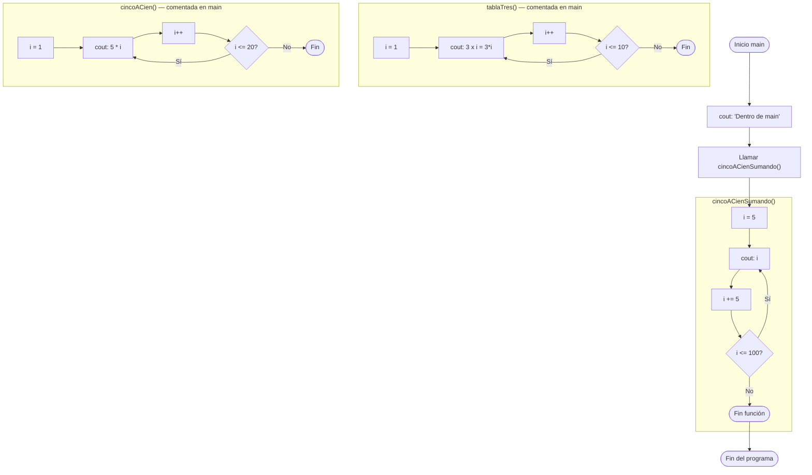

# clase-tres.cpp — Ciclo `do-while`: tabla del 3 y conteo de 5 en 5

## Descripción general

Este programa demuestra el uso del ciclo **`do-while`** para repetir operaciones
un número determinado de veces, garantizando que el bloque se ejecuta **al menos una vez**.

Contiene tres funciones:

- `tablaTres()` → imprime la **tabla de multiplicar del 3** (del 3×1 al 3×10)
- `cincoACien()` → imprime **múltiplos de 5** del 5 al 100 usando multiplicación
- `cincoACienSumando()` → imprime **múltiplos de 5** del 5 al 100 sumando de a 5

> **Nota:** en `main()` solo se llama a `cincoACienSumando()`. Las otras dos funciones
> están comentadas y sirven como referencia del proceso de aprendizaje.

---

## Librería incluida

```cpp
#include <iostream>

using namespace std;
```

| Elemento | Para qué sirve |
|---|---|
| `<iostream>` | Provee `cout` y `endl` para imprimir texto en la consola |
| `using namespace std` | Permite escribir `cout` en lugar de `std::cout` en todo el archivo |

---

## Concepto clave: `do-while`

A diferencia del `while` que evalúa la condición **antes** de ejecutar el bloque,
el `do-while` la evalúa **después**. Esto garantiza que el cuerpo se ejecute **al menos una vez**.

```
while:                      do-while:
┌──────────────────┐        ┌──────────────────┐
│ ¿condición?      │        │ ejecuta bloque   │  ← siempre ocurre
│  falsa → sale    │        │ ¿condición?      │
│  verdadera ↓     │        │  falsa → sale    │
│ ejecuta bloque   │        │  verdadera → ↑   │
└──────────────────┘        └──────────────────┘
```

---

## Funciones

### `tablaTres()`

```cpp
void tablaTres() {
    int i = 1;
    cout << "Tabla de multiplicar del numero 3" << endl;

    do
    {
        cout << " 3 x " << i << " = " << (3*i) << endl;
        i++;
    } while (i <= 10);
}
```

**¿Qué hace?**

1. `i` comienza en `1`.
2. Entra al bloque `do` sin evaluar ninguna condición.
3. Imprime `3 x i = resultado`.
4. Incrementa `i` con `i++`.
5. Evalúa `i <= 10` al final. Si es verdadero, repite desde el paso 2.
6. Cuando `i` llega a `11`, la condición es falsa y sale.

#### Traza de ejecución

| Iteración | `i` al entrar | Imprime | `i` después de `i++` | `i <= 10` |
|-----------|--------------|---------|----------------------|-----------|
| 1 | 1 | `3 x 1 = 3` | 2 | ✅ |
| 2 | 2 | `3 x 2 = 6` | 3 | ✅ |
| 3 | 3 | `3 x 3 = 9` | 4 | ✅ |
| 4 | 4 | `3 x 4 = 12` | 5 | ✅ |
| 5 | 5 | `3 x 5 = 15` | 6 | ✅ |
| 6 | 6 | `3 x 6 = 18` | 7 | ✅ |
| 7 | 7 | `3 x 7 = 21` | 8 | ✅ |
| 8 | 8 | `3 x 8 = 24` | 9 | ✅ |
| 9 | 9 | `3 x 9 = 27` | 10 | ✅ |
| 10 | 10 | `3 x 10 = 30` | 11 | ❌ sale |

**Salida en consola:**
```
Tabla de multiplicar del numero 3
 3 x 1 = 3
 3 x 2 = 6
 3 x 3 = 9
 3 x 4 = 12
 3 x 5 = 15
 3 x 6 = 18
 3 x 7 = 21
 3 x 8 = 24
 3 x 9 = 27
 3 x 10 = 30
```

---

### `cincoACien()`

```cpp
void cincoACien() {
    cout << "Se van a imprimir los numero de 5 en 5 hasta el 100" << endl;
    int i = 1;
    do {
        cout << ( 5 * i) << endl;
        i++;
    } while (i <= 20);
}
```

**¿Qué hace?**

1. `i` comienza en `1` y actúa como **contador de iteraciones** (no como el valor a imprimir).
2. En cada iteración imprime `5 * i`, que da los múltiplos de 5.
3. Incrementa `i` y continúa mientras `i <= 20`.
4. Cuando `i` llega a `21`, sale. Se habrán impreso 20 valores: 5, 10, 15 ... 100.

> **Diferencia con `cincoACienSumando()`:** aquí `i` es un índice multiplicador,
> no el valor acumulado directamente.

#### Traza de ejecución (primeras y últimas iteraciones)

| Iteración | `i` | `5 * i` | `i <= 20` |
|-----------|-----|---------|-----------|
| 1 | 1 | **5** | ✅ |
| 2 | 2 | **10** | ✅ |
| 3 | 3 | **15** | ✅ |
| … | … | … | … |
| 20 | 20 | **100** | ❌ sale |

**Salida en consola:**
```
Se van a imprimir los numero de 5 en 5 hasta el 100
5
10
15
...
100
```

---

### `cincoACienSumando()`

```cpp
void cincoACienSumando() {
    cout << "Se van a imprimir los numero de 5 en 5 hasta el 100" << endl;

    int i = 5;
    do {
        cout << (i) << endl;
        i += 5;
    } while (i <= 100);
}
```

**¿Qué hace?**

1. `i` comienza en `5` (el primer múltiplo de 5).
2. En cada iteración imprime el valor actual de `i`.
3. **Suma 5** a `i` con `i += 5`.
4. Continúa mientras `i <= 100`.
5. Cuando `i` llega a `105`, la condición es falsa y sale.

> **Diferencia clave:** aquí `i` **es directamente el valor a imprimir** (empieza en 5
> y crece de 5 en 5), no un índice multiplicador como en `cincoACien()`.

#### Traza de ejecución

| Iteración | `i` al entrar | Imprime | `i` después de `i += 5` | `i <= 100` |
|-----------|--------------|---------|--------------------------|-----------|
| 1 | 5 | **5** | 10 | ✅ |
| 2 | 10 | **10** | 15 | ✅ |
| 3 | 15 | **15** | 20 | ✅ |
| … | … | … | … | … |
| 20 | 100 | **100** | 105 | ❌ sale |

**Salida en consola:**
```
Se van a imprimir los numero de 5 en 5 hasta el 100
5
10
15
20
25
30
35
40
45
50
55
60
65
70
75
80
85
90
95
100
```

---

## Función `main()`

```cpp
int main() {
    cout << "Dentro de main" << endl;
    // tablaTres();      ← comentada
    // cincoACien();     ← comentada
    cincoACienSumando();
    return 0;
}
```

Solo se ejecuta `cincoACienSumando()`. Las otras dos funciones están **comentadas**,
lo que significa que el compilador las ignora en esta versión del programa.

**Salida completa del programa:**
```
Dentro de main
Se van a imprimir los numero de 5 en 5 hasta el 100
5
10
15
...
100
```

---

## Comparación entre las tres funciones

| Aspecto | `tablaTres()` | `cincoACien()` | `cincoACienSumando()` |
|---|---|---|---|
| Tipo de ciclo | `do-while` | `do-while` | `do-while` |
| `i` inicial | `1` | `1` | `5` |
| Qué imprime | `3 * i` | `5 * i` | `i` directamente |
| Condición de salida | `i <= 10` | `i <= 20` | `i <= 100` |
| Números impresos | 3, 6, 9 … 30 | 5, 10, 15 … 100 | 5, 10, 15 … 100 |
| ¿Activa en main? | ❌ comentada | ❌ comentada | ✅ sí |

---

## Pseudocódigo

```
INICIO

  FUNCIÓN tablaTres():
    i ← 1
    HACER
      imprimir "3 x " + i + " = " + (3 * i)
      i ← i + 1
    MIENTRAS i <= 10
  FIN FUNCIÓN

  FUNCIÓN cincoACien():
    i ← 1
    HACER
      imprimir 5 * i
      i ← i + 1
    MIENTRAS i <= 20
  FIN FUNCIÓN

  FUNCIÓN cincoACienSumando():
    i ← 5
    HACER
      imprimir i
      i ← i + 5
    MIENTRAS i <= 100
  FIN FUNCIÓN

  FUNCIÓN main():
    imprimir "Dentro de main"
    LLAMAR cincoACienSumando()
    retornar 0
  FIN FUNCIÓN

FIN
```

---

## Diagrama de flujo


